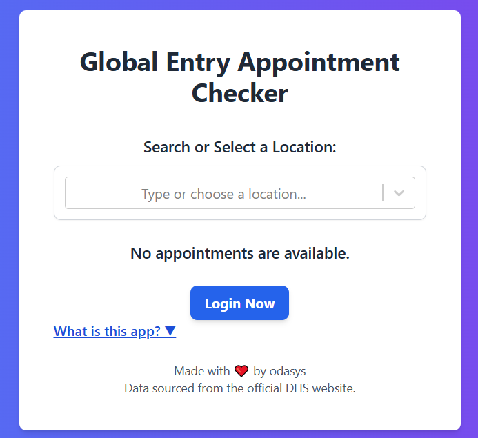
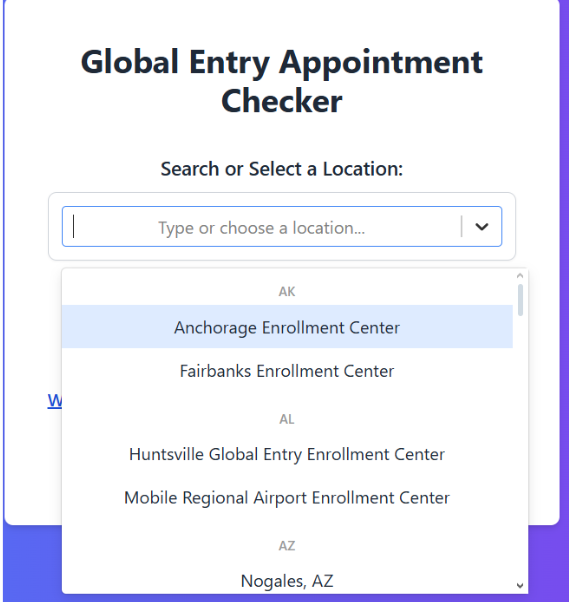
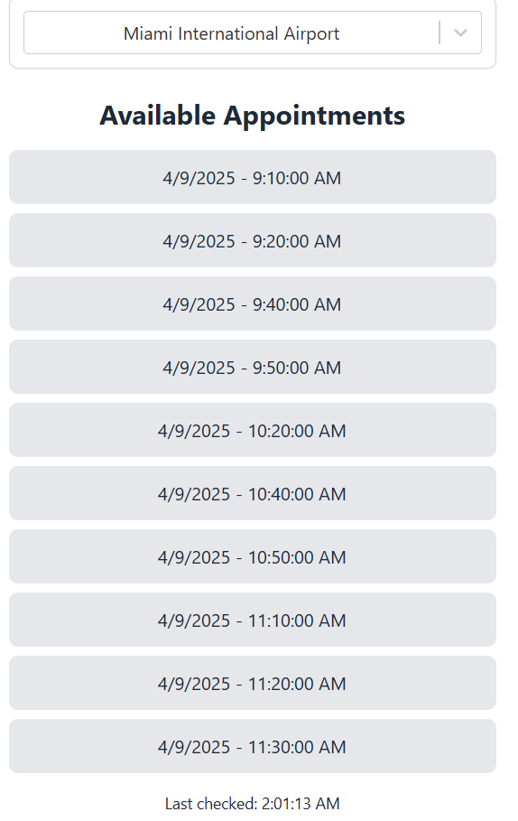

# 🌍 Global Entry Appointment Notifier

A modern, responsive Next.js web application that automatically tracks and notifies you when Global Entry interview appointments become available at your selected location.

---

## 📸 Demo

 

---

## 🔥 Features

- 🔍 **Searchable Location Picker**  
  Quickly find and select your desired enrollment center, grouped and sorted by state.

- ⏱ **Automatic Refreshing**  
  Continuously checks for available time slots every 5 seconds.

- 🔔 **Real-Time Notifications**  
  Instantly alerts you with a browser notification and sound when a slot is found.

- 🛑 **Smart Polling**  
  Auto-refresh stops once an appointment becomes available.

- 🔐 **Quick Login Button**  
  Directs you to the official TTP login page to book your appointment immediately.

---

## 📦 Tech Stack

- **Framework:** [Next.js](https://nextjs.org/)
- **Styling:** [Tailwind CSS](https://tailwindcss.com/)
- **Dropdown:** [React Select](https://react-select.com/)

---